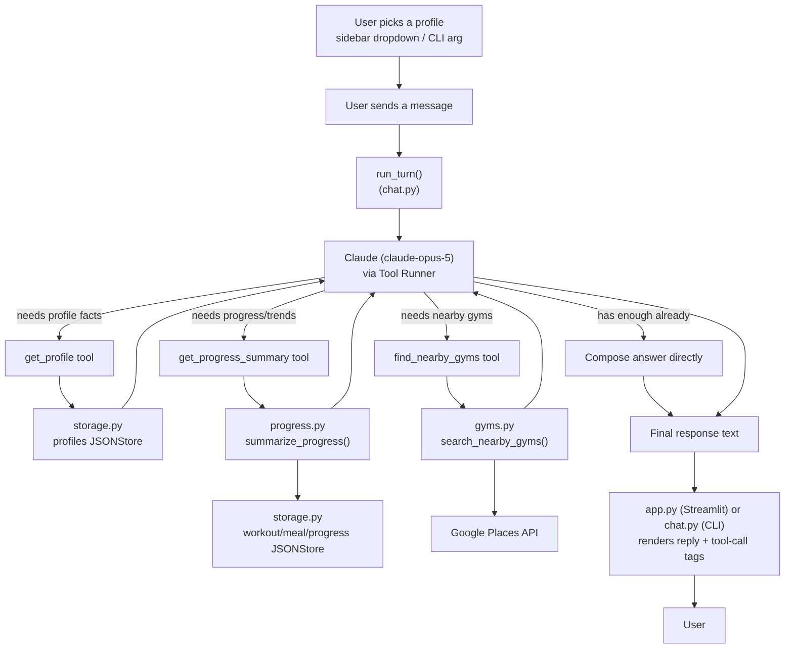
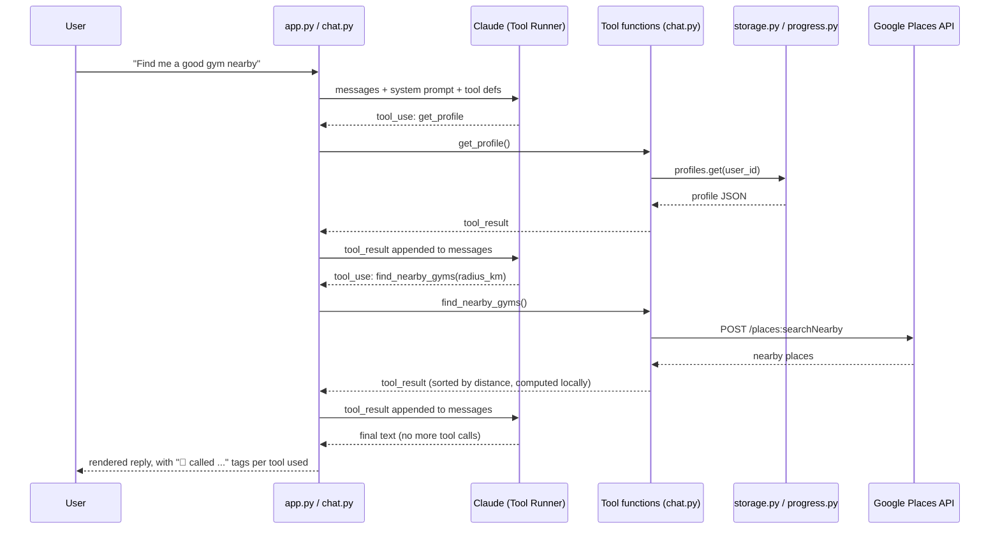

# Epsilon Fitness Agent — Application Flow

Diagrams use [Mermaid](https://mermaid.js.org/) syntax, which renders natively on GitHub.

## High-level flow

Claude decides at runtime which (if any) tools it needs — it doesn't always fetch
everything. Once fetched, results stay in the conversation so later turns don't
re-fetch them.

## Per-turn sequence (example: "Find me a good gym nearby")

## Components

| File | Role |
|---|---|
| `data/*.json` | Mock user profiles, workout/meal/progress logs |
| `epsilon_fitness_agent/storage.py` | `JSONStore` — load/query/save/delete over the JSON files |
| `epsilon_fitness_agent/progress.py` | Local (non-LLM) trend computation from logs — sessions/week, macro averages, weight/body-fat deltas |
| `epsilon_fitness_agent/gyms.py` | Google Places API wrapper — nearby gym search, local distance sort (haversine) |
| `chat.py` | System prompt, the 3 tool definitions (`get_profile`, `get_progress_summary`, `find_nearby_gyms`), and `run_turn()` — the tool-calling loop |
| `app.py` | Streamlit chat UI — renders messages and tool-call tags, drives `run_turn()` per user input |
| `.env` | `ANTHROPIC_API_KEY`, `GOOGLE_MAPS_API_KEY` |

## Why tool calling instead of always injecting data

Earlier versions embedded the full profile + all logs into every system prompt.
Now the model calls tools only when a question actually needs that data, and reuses
results already fetched earlier in the same conversation — cutting tokens on
generic questions (e.g. "what's the difference between HIIT and steady-state
cardio?") to near zero extra context.
